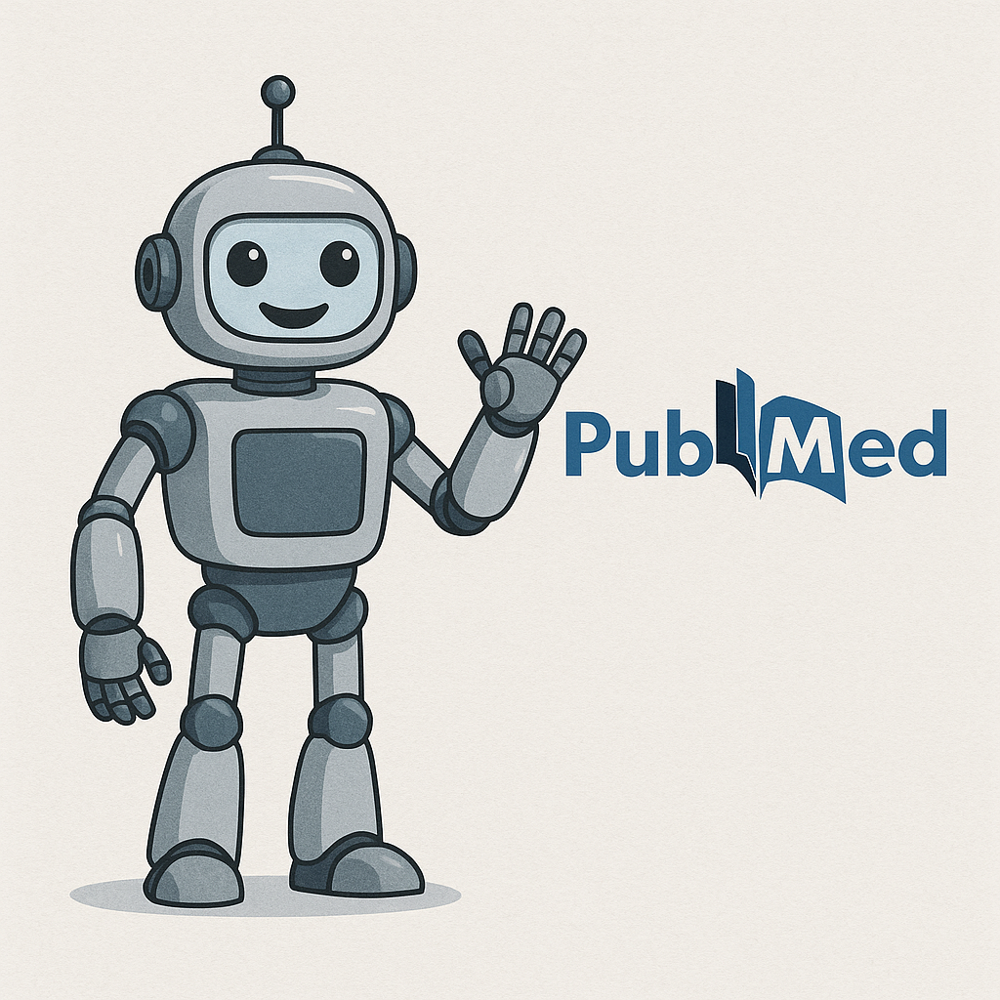

Introdução
++++++++++++++

Há várias ferramentas computacionais para pesquisa científica, dentre elas destacamos: PubMed, Web of Science e Google Acadêmico.

Essas ferramentas são essenciais para a recuperação de conhecimento científico, sendo o PubMed um recurso particularmente valioso no domínio biomédico, integrando as bases de dados MEDLINE, PMC e Bookshelf do NCBI.

A PubMed é a ferramenta de busca de referências da Biblioteca Nacional de Medicina (NLM), oferecendo acesso gratuito a mais de 37 milhões de artigos científicos (em novembro de 2024). Ela oferece uma interface de website (https://pubmed.ncbi.nlm.nih.gov/), uma API, além de serviços web para consulta de questões biomédicas. Funcionalmente, ela recupera referências com base em um modelo de Linguagem de Consulta Estruturada (SQL - *Structured Query Language*), onde estas consultas utilizam termos (palavras) ordenados e operadores lógicos (AND e OR) a serem processados utilizando álgebra booleana. A PubMed também utiliza termos de Cabeçalhos de Assunto Médico (MeSH) para classificação e dentro do NCBI pode-se acessar outras bases de dados complementares como Genoma, Nucleotídeo e Proteína para buscas especializadas.

Há ainda outras ferramentas de auxilio à pesquisa e conceitos como o Bookshelf (do NCBI) e o Scitable (da Nature).

Os artigos científicos podem estar em "Domínio Público" (abertos para leitura) ou não. Caso estejam disponíveis você os encontra na PubMed Central (PMC), um link que aparece automaticamente após uma pesquisa na PubMed (se disponível).

Links
===========

  * PubMed (NCBI)

https://pubmed.ncbi.nlm.nih.gov/

  * Web of Science (Clarivate)

https://clarivate.com/academia-government/scientific-and-academic-research/research-discovery-and-referencing/web-of-science/

  * Google Acadêmico (Scholar)

https://scholar.google.com/

  * MEDLINE (NCBI) - NLM (National Library of Medicine)

https://www.nlm.nih.gov/medline/

  * PMC (PubMed Central - NCBI)

https://pmc.ncbi.nlm.nih.gov/

  * Bookshelf (NCBI)

https://www.ncbi.nlm.nih.gov/books/

  * Scitabler (Nature)

https://www.nature.com/scitable/

