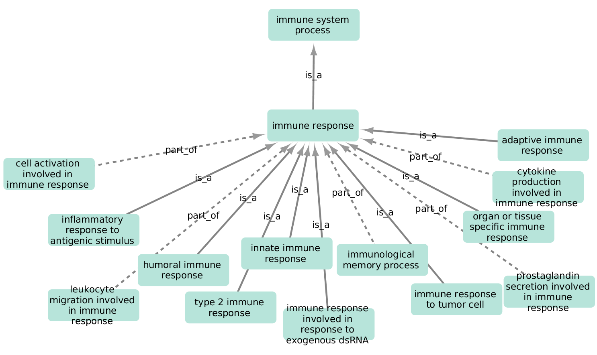

MESH e Ontologias
++++++++++++++++++++

O que é uma ontologia biomédica?
------------------------------------

Introdução
=============

Uma `ontologia biomédica` é  uma representação estruturada do conhecimento no domínio biomédico projetada para ser compreendida tanto por humanos quanto por computadores. As primeiras ontolgias foram criadas para se extrair conhecimento das páginas da internet e definidas pela W3C (https://www.w3.org/), órgão regulador da internet.

Uma ontologia biomédica é um grafo onde os termos são nós, relacionados entre si por conexões (*edges*) que são verbos (ações). Ela define conceitos, suas relações e propriedades de forma precisa e padronizada, permitindo armazenamento, recuperação e análise de dados mais eficientes.

Através de ontologias podemos extrair conhecimento e verificar se frases ou textos estão corretos.

As ontolgias vêm ganhando incrível evidência nos últimos anos, pois elas foram integradas a complexos *frameworks* ligados à Inteligência Artificial para dar consistência semântica e científica às pesquisas em liguagem natural (*queries*) (ver: https://www.slolab.ai/ e https://biochatter.org/latest/)

Exemplo
========

A seguir um pequeno exemplo de uma ontologia:

Parte de uma Ontologia para o **Sistema Imunológico**. Exemplo: (cell activation) faz parte da (resposta imune); já (resposta inflamatória) é uma (resposta imune)

link: https://tools.dice-database.org/GOnet/doc/index

\
\

Ontologias biomédicas
------------------------

Há várias ontologias descrevendo conceitos de biomédicos, abaixo relacionamos algumas delas:

  . GO - Gene Ontolgoy - https://geneontology.org 
    * Biological Process
    * Molecular Function
    * Cellular Component

  * DO - Disease Ontology - https://disease-ontology.org 
  * OBI - Ontology for Biomedical Investigations - https://obi-ontology.org 
  * MP - Mammalian Phenotype Ontology (EMBL) - https://www.ebi.ac.uk/ols4/ontologies/mp 
  * IDO - Infectious Disease Ontology (EMBL) - https://www.ebi.ac.uk/ols4/ontologies/ido 
  * SNOMED-CTG - Snomed Clinical Terminology - https://www.snomed.org/value-of-snomedct 
  * MESH - https://www.nlm.nih.gov/mesh/meshhome.html 

entre diversas outras.

MESH - *Medical Subject Headings*
-----------------------------------

O tesauro Medical Subject Headings (MeSH) é um vocabulário controlado e hierarquicamente organizado, produzido pela Biblioteca Nacional de Medicina (National Library of Medicine). É usado para indexação, catalogação e busca de informações biomédicas e relacionadas à saúde. O MeSH inclui os cabeçalhos de assunto que aparecem no MEDLINE/PubMed, no Catálogo NLM e em outras bases de dados NLM. O MeSH não é uma ontologia em seu senso formal, mas contém vários conceitos de uma ontologia como vocabulário controlado e estruturado na forma de uma árvore. Não é uma ontologia, pois não contempla Axiomas formais, relações complexas e classes. Porém, ele contempla relações semânticas muito úteis para o entendimendo, busca e contextualização de termos biomédicos, como:

  - Termo mais amplo (Broader Term - BT): Um conceito mais geral.
  - Termo mais restrito (Narrower Term - NT): Um conceito mais específico.
  - Termo relacionado (Related Term - RT): Conceitos que estão associados, mas não hierarquicamente relacionados.
  - Uso para (Use For - UF): Sinônimos ou termos preferenciais.
  - Termo de entrada (Entry Term - ET): Termos não preferenciais que mapeiam para um cabeçalho MeSH.

Relações como as abaixo, usuais em ontologias, não são encontradas no MeSH:

  - é um
  - faz parte de
  - regula
  - ativa 
  - reprime
  - etc.

Ou seja, o MeSH foi criado para auxílio semântico ao vocabulário biomédico e apoio à PubMed para a recuperação de textos.

**Exercício**

  1. Procure por **Hypertension** no link: https://meshb.nlm.nih.gov/search
  2. Clique em MeSH Tree Sstructure
  3. Clique em "Essential Hypertension"
  4. Clique em **RDF Unique Identifier** 
    a. aqui vemos os seus qualificadores
    b. e termos relacionados
    c. além de outros itens

  

Veja link (inglês):

https://medium.com/@jaywang.recsys/ontology-taxonomy-and-graph-standards-owl-rdf-rdfs-skos-052db21a6027

https://geneontology.org/docs/ontology-relations/

