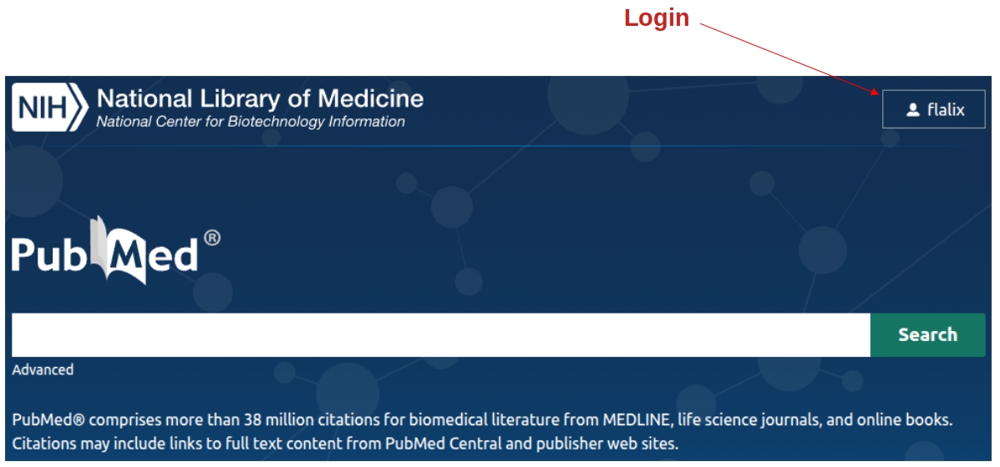
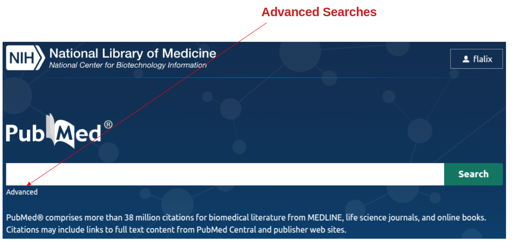
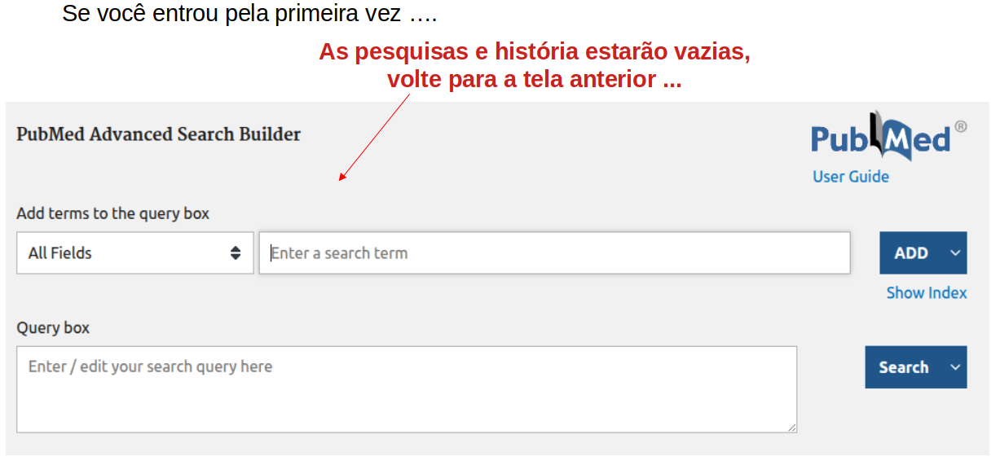
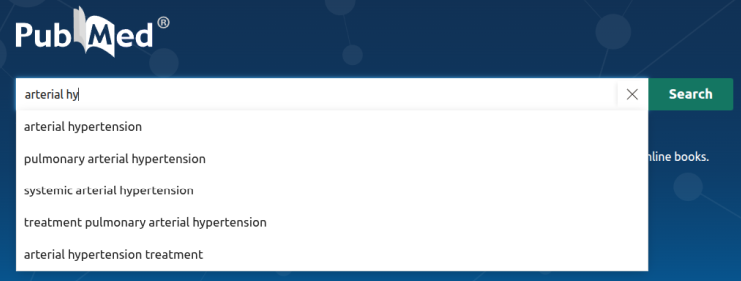
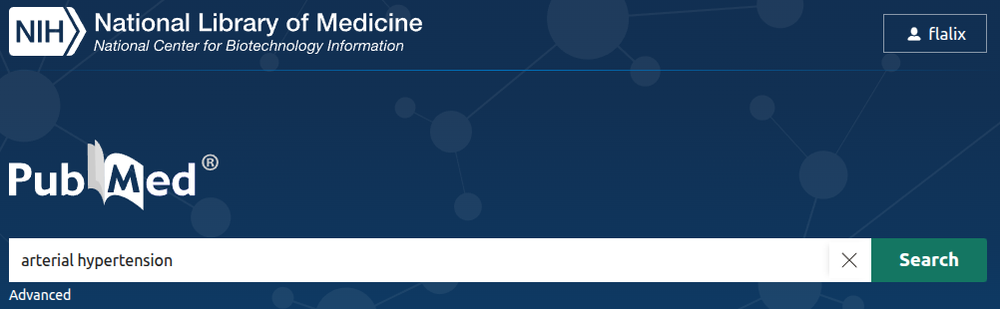
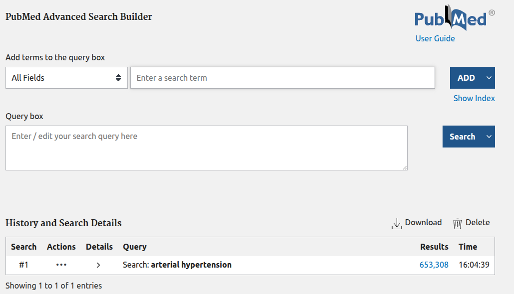
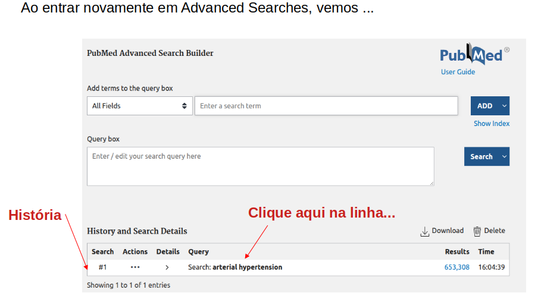
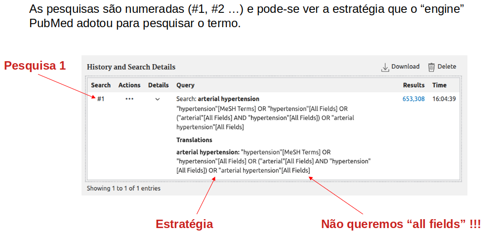
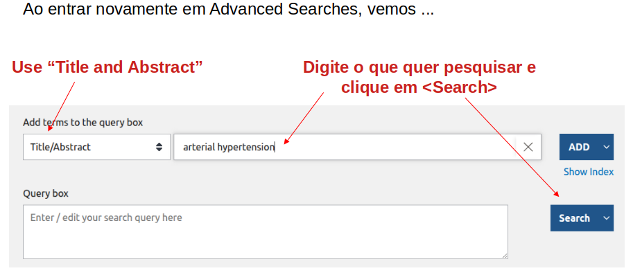
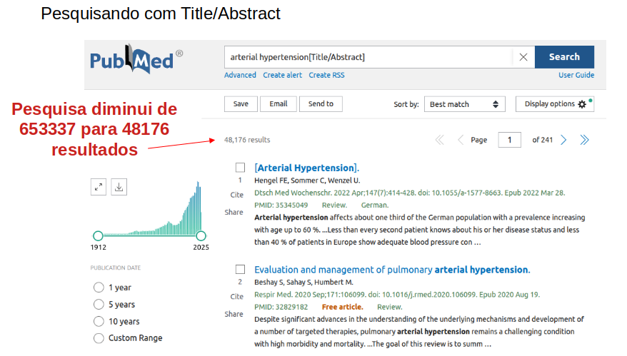

Pesquisas avançadas
+++++++++++++++++++++++++++++

Vamos supor que queremos estudar **Hipertensão Arterial** em recém-nascidos, crianças e jovens. Não queremos adultos e idosos!

Há duas formas para pesquisar:

.. tip::
   **recém-nascidos, crianças e jovens**

   1.  (arterial hypertension) AND (newborn OR children OR young )
   2.  (arterial hypertension) NOT adult NOT elder
   3.  (arterial hypertension) AND (newborn OR children OR young ) NOT adult NOT elder

A segunda forma, excluindo Adultos (adult) e Idosos (elder) é pior pois estes conceitos podem não ser encontrados no título e abstract, como veremos a seguir. Aqui apresentamos o **conector booleano NOT**: NOT adult = excluir **adult**. A terceira forma de se escrever a *query* exclui **adultos** e **idosos**. Mas, lembrem-se que sempre podemos encontrar artigos que estudam, p.ex., **Jovens**, **Adultos** e **Idosos** e estaremos excluindo estes artigos.

Possivelmente a primeira forma é melhor, mas há erros que serão apontados neste exemplo, mais a adiante.

Construção da *query*
======================

Em primeiro lugar, mas não obrigatório, faça seu login para guardar todas os seus *queries* e depois clique em *Advanced*.

\

Caso você clique em <Advanced>

\

... verá que a **história de suas pesquisas** estará vazia,

\

Primeiro *query*
-----------------

Vamos iniciar o nosso primeiro *query* (indagação, pergunta) usando a tela inicial do PubMed. De acordo que escrevemos "arterial hyp" o aplicativo autocompletará com palavras ou conceitos de acordo com seu dicionário de termos em biomedicina.

\

Aceitando um termo
===================

Para aceitar o termo desejado, neste caso, clique sobre "arterial hypertension", e dê um clique em <Search> (pesquisar)

\

Advanced & History
=====================

Agora clique em <Advanced> e voltará ao formulário de **História** (*History and Search Details*). Verá que existe a pesquisa 1 ou #1.

\

Observe que ao clicar na primeira linha (#1 - pesquisa 1), ela se abrirá mostrando a estratégia de busca interna do *engine* da PubMed.

\

Erro grave: **all fields**
==============================

Como já explicamos anteriormente, o retorno de uma pesquisa pode trazer referências erradas ou indesejadas, a isto denominamos de Falsos Positivos (FP). Ao clicar na primeira linha da História, vemos que aparece ao lado de cada termo da pesquisa, entre chaves, **all fields**. E isto é altamente indesejado. **Porque?**

\

De forma siplificada, um artigo cientifico é divido em título, autores, abstract, palavras-chaves (*keyowords*), texto, referências e material suplementar. Quando se pesquisa **All Fieldes**, todos estes campos são pesqisados. Logo, p.ex., um artigo de Saúde Pública pode ter como referência um estudo clínico de **Hipertensão Arterial**, e não queremos um Artigo de Saúde Pública. Logo, **All Fields** trará vários falsos positivos (FP) consigo, pois permite pesquisar em referências.

Melhorando a pesquisa
-------------------------

Para se reduzir o número de FP, devemos colocar seguindamente a cada termo o termo **Title/Abstract** (entre colchetes), de forma a se restringir a pesquisa somente a Títulos e Abstacts. Com isto podemos gerar Falsos Negativos (FN), correto? Sim, correto. Mas, dificilmente um artigo de hipertensão arterial não conterá estas palavras em Título ou no Abstract. Logo, este é o risco que corremos.

Adicionando a chave **Title/Abastract**.

\

Impressionante resultado
=========================

Após clicar em <Search> voltamos para tela inicial e de 653 mil resultados com **All Fields** chegamos a aproximadamente 48 mil resultados com o filtro **Title/Abstract**! 

.. warning::
   Desafio: Será que geramos tantos FN?
