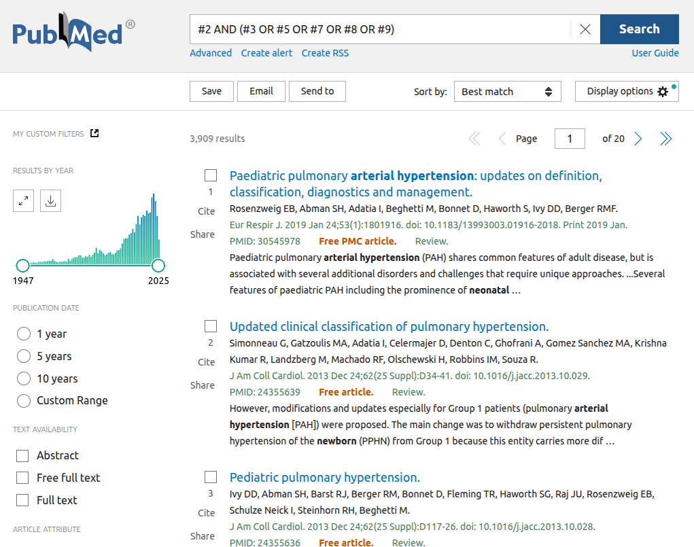

Montando *queries* complexos
+++++++++++++++++++++++++++++

A seguir vamos apresentar a técnica mais fácil e segura de se montar uma *query* complexa.

Dividindo para conquistar
--------------------------

Vamos supor que queremos pesquisar: **Hipertensão Arterial em jovens, crianças ou recém-nascidos**

Como fazer?
============

A recomendação é criar várias pesquisas:
  1. arterial hypertension [All Fields]
  2. arterial hypertension [Title/Abstract]
  3. young [Title/Abstract]
  4. cildren [Title/Abstract]
  5. newborn [Title/Abstract]

\

\

E depois, fazemos uma pesquisa final concatenando os termos e usando conectores booleanos (AND e OR e parêntesis).

\

Repare como é mais fácil montar os ANDs e ORs. Jovens, Crianças e Neonatos ficam entre parêntesis e utilizam a cláusula OR para se UNIR todos eles. Já **hipertensão arterial** fica de fora, à esquerda, seguida do conector booleano **AND**, pois queremos pesquisar esta patologia neste grupo / faixa etária.

Então funcionou? Tudo Correto?

Sempre há erros - estude os resultados
-------------------------------------------

Vamos analisar os resultado,

\

\

Vemos que aparecem palavaras que não havíamos pesquisado como **childhood**, **neonate**, **infant**, e **adolescent**. Você verá que este problema não existe em pesquisas com IA, uma vez que semanticamente são palavras parecidas, ocupam o espaço de embedding similar (ver nas próximas sessões).

Logo, podemos melhorar nossa pesquisa adiconando estas palavras. E ao final teremos vários **OR**s encadeados.

Aqui trocamos **children** e **childhood** por **child*** (com um asterístico ao fim, um wildcard).

.. tip::
   **pesquisa final** - todas com [title/abstract]

   * #2 - arterial hypertension
   * #3 - young
   * #5 - newborn
   * #7 - child*
   * #8 - infant*
   * #9 - neonat*

\

\

.. note::
   **Query** - #2 AND (#3 OR #5 OR #7 OR #8 OR #9)

\

Resultado final
================

Passamos de 2911 artigos para 3909. Descobrimos, possivelmente, 998 FN!

\

\

.. warning::
   Observem como é difícil indenticar Falsos Negativos (FN)

