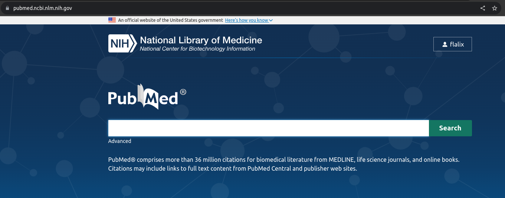

Pesquisa básica (uma palavra)
++++++++++++++++++++++++++++++

Pode-se entender como pesquisa ``básica`` uma busca rápida de uma ou duas palavras, sem se ater a controles de Falsos Positivos (FP) e Falsos Negativos (FN).

Cuidado: a palavra pode ser composta, como: 'blood pressure'. Neste caso 'blood pressure' refere-se a um termo ou `uma palavra composta`.

\

Abrindo a PubMed pela primeira vez
-------------------------------------

Por exemplo, abre-se o *site* PubMed e escreve-se um palavra

.. tip::
   Repare que ao digitar **em inglês** um palavra, o pesquisador vai autocompletando e mostrando termos do dicionário da PubMed.

\

Digite uma palavra ou termo
------------------------------

Digite ``diabetes`` e clique em <search>

\

Depois de pesquisado deve aparecer um conteúdo como,

\

.. image:: ../images/diabetes_searched.png\
  :align: center
  :width: 90%
  :alt: PubMed and AI

\

Pesquisando um artigo
------------------------------

Pode-se navegar entre as páginas e ao ao clicar num artigo, abre a página PubMed do mesmo,

\

.. image:: ../images/article_searched.png\
  :align: center
  :width: 90%
  :alt: PubMed and AI

\

A página do artigo contém diversas informações
-----------------------------------------------

.. image:: ../images/article_details.png\
  :align: center
  :width: 90%
  :alt: PubMed and AI

\

Cite
-------

Clicando em `cite` (citação) abre-se uma janela onde se pode copiar o texto da citação do artigo.

Mas, tome cuidado quando você for publicar o seus artigo, pois este é um dado formato. Cada revista exige um formato diferente e os aplicativo Zotero, Mendeley, EndNote, RefWorks, and Qiqqa podem controlar isto automaticamente para você.

Logo da Revista
----------------

Neste local deve aparecer o Logo da Revista e o Logo da PMC (PubMed Central). Caso o Logo da PMC não apareça, muito possivelmente o artigo não está aberto para leitura e somente o Abstract, Authors, Keywords e Referências são disponibilizados pelas revista. Se o logo da PMC aparecer, preferencialmente, clique nele, pois poderá baixar o artigo.

Affiliations
--------------

Ao clicar em `Affiliations` cada autor e sua afiliação aparecerá. Por vezes, ao clicar no Author o *site* levará para o ORCID ou Google-Scholar.

Se você não tem o registro no Orcid (https://orcid.org/) e for um `futuro pesquisador`, aproveite o link e faça seu registro.

Quando publicar seu primeiro artigo ele aparecerá automaticamente na PubMed e no Google Scholar (https://scholar.google.com/), além dos diversos outros *sites* já mencionados.

