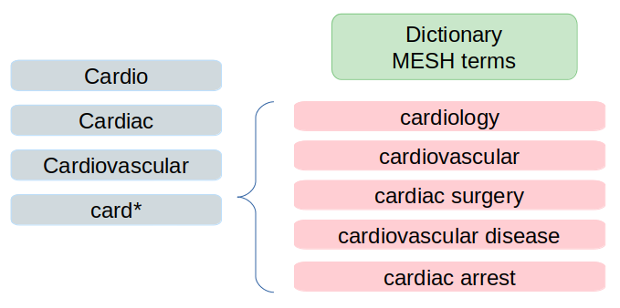

Minimizando Falsos Negativos
++++++++++++++++++++++++++++++

Vamos supor que você faz uma pesquisa e aparecem 100 resultados, mas você sabe que existem bem mais que 100 artigos. O que deve fazer?

Neste caso você se deparou com muitos Falsos Negativos (FN). Ou seja, resultados que não aparecereram (resultados com status Negativo), mas que deveriam aparecer (Negativos, porém Errados ou Falsos).

Por vezes podemos minimizar os FN
-------------------------------------

Algumas palavras podem ter várias formas de serem escritas, como:

  1. card: cardíaco, cardíaca, cardiologia, cardiovascular, etc
  2. infec: infectologia, infecciosa, infectocontagiosa, etc
  3. pense em mais casos ... como exercício.

Solução minimizante
--------------------------

Na pesquisa PubMed, assim como na maioria das pesqisas na Internet (como pesquisa Google), você pode usar "wildcards" como asterisco (*). Troque a palavra que está pesquisando pelo seu "radical" (*stem word*) e acrescente um asterisco.

Mais adiante veremos o que é MESH. 

.. note::
   Utilize um RADICAL + *; por exemplo: **card***

.. warning::
   Se você reduzir muito a palavra, menor que o radical, pode incorrer em criar muitos Falsos Positivos (FP)

.. tip::
   O que é um Falso Positivo?

