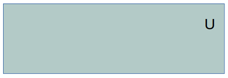
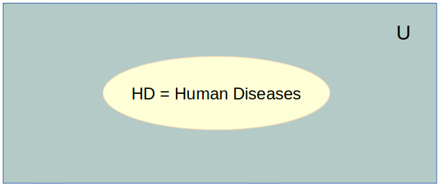
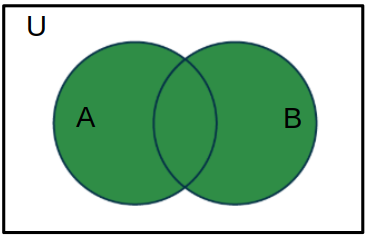
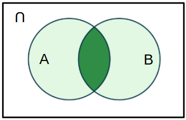

Teoria dos conjuntos
++++++++++++++++++++++

Resumo
--------

Um conjunto é uma coleção ou agrupamento de objetos distintos.

Portanto, qualquer objeto (espécie ou elemento) pertence ou não ao conjunto.

Pode-se desenhar conjuntos como círculos ou retângulos como formas geométricas.

Os elementos de um conjunto são denotados por letras maiúsculas (A, B); e representam qualquer conceito, por exemplo, o **conjunto de pacientes** = **P** = {P1, P2, … Pn}

Usa-se chaves para denotar um conjunto na forma algébrica.

conjunto = {A, B, C, …. Z}

Em matemática, na teoria dos conjuntos, todo o UNIVERSO observado é U ou Ω.

Universo é um conjunto de todos os elementos de uma questão estudada, como o espaço de todas as doenças, tratamentos, espécies animais e assim por diante.

\

Exemplos:

U = conjunto de todas as doenças = {D1, D2, ...Dn}
U = letras do alfabeto
U = CID (Classificação Internacional de Doenças)

\

Conjuntos e Elementos
-------------------------------

Relações
==============

A seguir, vamos exemplificar a relação entre conjuntos e elementos versus conjuntos.

.. note::
  **Relações entre conjuntos**

  * Definimos U como todo o universo das **Doenças** conhecidas no planeta Terra.
  * Existem as **Doenças Humanas** (DH)
  * Logo, U contém DH* U ⊃ DH
  * Ou seja, DH está contido em U
  * DH está contido em U
  * DH ⊂ U

.. note::
  **Relações entre elementos e conjuntos**

  * Um elemento pertence a um conjunto
  * Uma doença humana pertence a DH: **diabetes** ∈ DH
  * Uma doença nas aves pode não pertencer a DH: **gripe aviária** ∉ DH

Operadores
--------------

Dados dois conjuntos podemos obter:
  a. a **união** entre eles
  b. a **intersecção** entre eles

Dados dois conjuntos denomidados A e B,

União
========

  * A U B = A + B - A ∩ B = união(A,B) 
     - união é o conjunto de todos os elementos contidos em A e B, sem repetição.
     - uma vez que em A+B somamos duas vezes os elementos repetidos, subtraímos a interseção para calcular a união.s

Intersecção
=============

   * A ∩ B = interseção(A,B) = conjuntos dos elementos comuns

\
\

.. warning::
  **Desafio**

  * se A U B = A + B, dizemos que que os dois conjuntos não tem elementos comuns.
  * logo, A U B = A + B  =>  A ∩ B = conjunto vazio = ∅ (phi maiúsulo)
  * o símbolo => quer dizer **implica**.

Simbologia:
============

   a. União:  **U** ou **v**, na álgebra de Bool é **OR**
   b. Interseção: **∩** or **∧**, na álgebra de Bool é **AND**

.. tip::
  Mais detalhes em https://pt.wikipedia.org/wiki/Lista_de_s%C3%ADmbolos_l%C3%B3gicos
