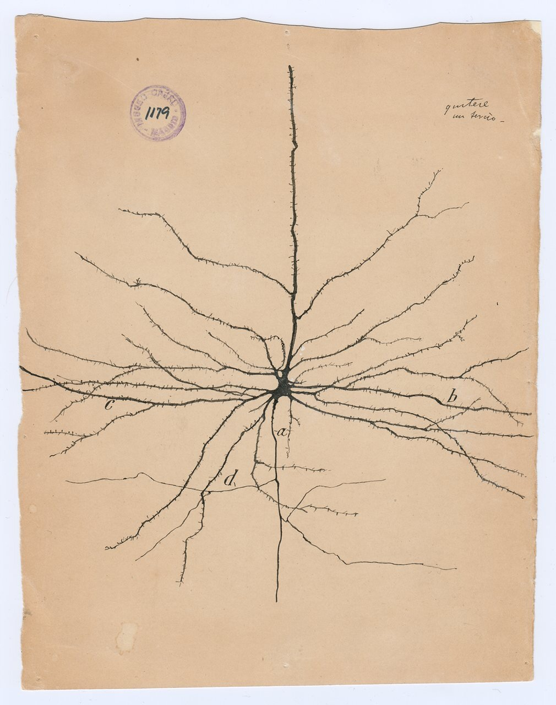
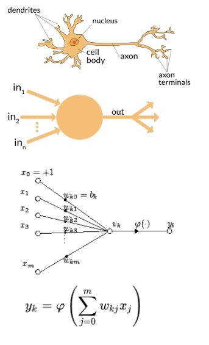
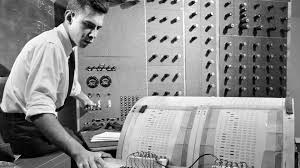
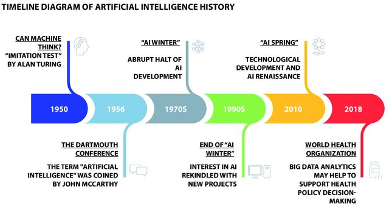
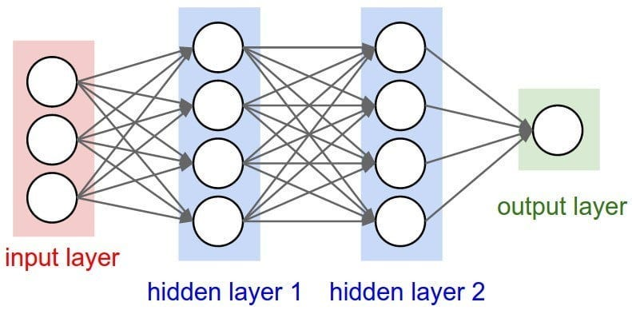
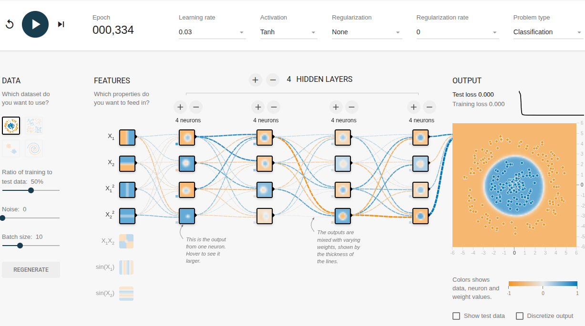

História: até 2016
+++++++++++++++++++

Introdução
------------

É muito difícil e complexo explicar o que é Intelgiência Artiticial (IA) nos dias atuais (2025). Mas, vamos tentar explicar relatando a história, exemplos e utilizando algumas metáforas. Uma das dificuldades se deve por ser necessário um bom conhecimento de matemática e aprendizado de máquina (*Machine Learning* or **ML**). Portanto, mostraremos como utilizar a IA focando em recuperação de informações científicas, em especial biomédicas, e comparando com a recuperação de referências oferecida pela PubMed.

Modelos iniciais
--------------------

Na década de 1870, o cientista Santiago Jamón y Cajal, espanhol, descreveu os primeiros neurônios e criou o estudo da neurologia. Seus trabalhos foram fundamentais para diversas áreas de Biologia e da Medicina e também serviram de modelo aos primeiros **Neurônios Artificiais**.

ref: https://www.linkedin.com/pulse/art-science-santiago-ram%C3%B3n-y-cajal-tim-vancamp/

https://blogs.scientificamerican.com/illusion-chasers/santiago-ramon-y-cajal-the-young-artist-who-grew-up-to-invent-neuroscience/

\
\

Na década de 1940 von Neuman e Alan Turing *desenharam* e propuseram o primeiro computador. Em 1946 foi construído o ENIAC (Electronic Numerical Integrator and Computer). Naquele momento, possivelmente, alguns cientistas entenderam que o mesmo tinha um severo fator limitante: seus cálculos eram seriais. Em 1943 Warren McCulloch e Walter Pitts propuseram um **neurônio artificial**, sua vantagem: processamento paralelo.

O modelo de McCulloch e Pitts mimetiza um neurônio de Cajal, tendo várias entradas (*inputs*) um corpo celular (Soma) que faz uma operação como adição e uma saída φ que é uma função de transformação ou normalização: saída ou *output* = φ(soma das entradas com pesos), como vemos no desenho abaixo.

ref: https://en.wikipedia.org/wiki/Artificial_neuron

A seguir em 1949, Touring, precocemente imaginou que a máquina, ainda que primitiva, poderia ser *inteligente*. E propôs o **Teste de Touring** (ver https://en.wikipedia.org/wiki/Turing_test). Feliz ou infelizmente, John McCarthy cunhou o termo **Inteligência Artificial**, mas o correto é a denominação **Aprendizado de Máquina** (*Machine Learning* ou **ML**).

Primeiro Neurônio
--------------------

Em 1957 na Universidade de Cornell, Frank Rosenblatt, monta o primeiro circuito elétrico que mimetizava o **Neurônio Artificial**, denominado Percepton. Daí para frente o planeta estava pronto para sair da *Era Industrial* e entrar na *Era da Informação*. Porém, a evolução dos computadores seriais foi incrivelmente bem sucedida e de forma exponencial, sendo que no início dos anos 80, devido a minituarização dos circuitos eletrônicos, surge a micro informática e os computadores pessoais. Já a teoria e desenvolvimento do circuitos neurais artificiais passou pela grande crise denominada o **Inverno da IA** (de ~1970-1990).

referência: 

https://iatracker.com.br/glossario/o-que-e-xor-problem/

https://en.wikipedia.org/wiki/AI_winter. 

Linha do Tempo
---------------

Abaixo um "rascunho" de linha do tempo para mostrar a evolução da IA até 2018. Mas, foi a partir de 2017 que ocorre a **grande revolução** com o advento das LLMs, como veremos nos próximos capítulos.

\

ref: Bellini V, Cascella M, Cutugno F, Russo M, Lanza R, Compagnone C, Bignami EG. Understanding basic principles of Artificial Intelligence: a practical guide for intensivists. Acta Biomed. 2022 Oct 26;93(5):e2022297. doi: 10.23750/abm.v93i5.13626. PMID: 36300214; PMCID: PMC9686179.

ANN profunda: *Deep Learning*
------------------------------

Do ínicio da década de 1990 até 2012 surge a primeira *era tecnológica* da IA, conhecida como Deep-Learning (DL). DL é o encadeamento de neurônios em várias camadas. Ou seja, à esquerda há a **entrada** ou *input*, à direita há a **saída** ou *output* e no meio as camadas de *neurônios escondidas* denominadas *hidden layers*. 

Um esquema de ANN,

\

Treinando uma rede neural
-----------------------------

A **grande sacada** foi como *ajustar os pesos* de cada neurônio (valores sobre cada entrada do percepton + um offset) e ir modificando os mesmos de forma que o *output* fosse igual ou próximo a uma **saída** conhecida. Portanto, na etapa de treinameto de uma ANN, neurônios importantes vão ligando com saída se aproximando do sinal 1, e neurônios menos importantes ficam no intervalo de sinais de saída entre 0.1 e 0.9 e aqueles que não colaboram com o resultado final são desligados. A técnica é levar os valores de entrada para cada uma das camadas (*hidden layers*), passando por cada neurônio e calculando a função neural φ, num algoritmo denominado "feedforward". Os neurônio **finais de saída** (*output*) preditos, são comparados com uma **saída conhecida** (p.ex.: entrada 1, 3, 5 -> Saída: Paciente São, entradas 2, 4, 6 --> Saída: Paciente Doente). O erro é mensurado por uma função denominada **Custo**. O erro é propagado de volta (*backpropagation*), até a que a função de custo atinja um mínimo. Neste momento a rede estará treinada e pronta para se analisar se funciona com novos dados (dados de teste). O que se armazena, ao final, é a topologia da rede e os pesos encontrados que minimizaram a função custo de acordo com o treinamento da rede.

Caso a função da ANN seja o de um classificador então a rede se ajusta para acertar o *output* de classificação, como: a) doente ou são, b) rico, médio, pobre, c) 5 níveis de inflamação, etc. Já se a função da ANN é de calcular uma regressão, o *output* torna-se, p.ex., 50 valores discretos de uma função matemática num determinado domínio de valores. Como exemplo: a) ajustar a uma parábola, b) um segmento de curva qualquer, ou c) semi-círculo.

Mas, como se define **Doente** e **São** numa ANN? Isto é simples, denominamos esta técnica como **one-hot encoding**, ou seja, basta numerar os valores categóricos: **encoding**: Doente:0, São:1 e **decoding**: 0:Doente e 1:São. Agora a ANN pode trabalhar, pois transformamos todas classes nominais em números inteiros.

Simulação
-----------

A seguir mostramos uma simulação de uma *Rede Neural Artificial* (ANN) utilizando `tensorflow` (uma das ferramentas para programação de ANNs).

\

\

Vamos Simular? https://playground.tensorflow.org/

