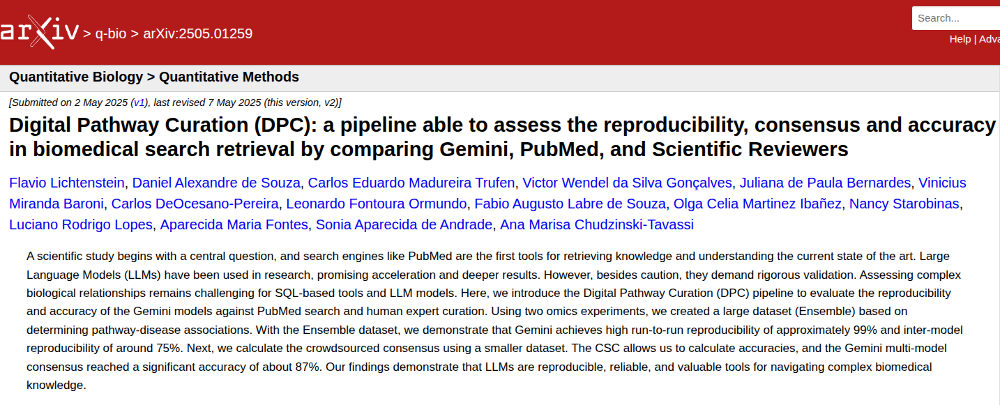

Comparando PubMed x Gemini
+++++++++++++++++++++++++++++

Como vimos, atualmente (Junho de 2025), pesquisar na PubMed e pesquisar com ferramentas de IA são operações distintas e possivelmente complementares.

PubMed baseia-se numa pesquisa com termos controlados (sempre que possível) e lógica booleana, porém pesquisas muito complexas levam a um aumento de FP. Ou seja, uma vez que a pesquisa é baseada em construções de SQL, ela não é semântica e cabe ao usuário inserir os termos corretos e entender que junto a cada termo deve acompanhar de **OR** e um ou diversos sinônimos. Em biologia molecular e celular vários termos evoluíram no tempo e suas denominações eventualmente foram alteradas. P.ex., o canal de sódio SCN1A denominava-se Nav1.1, IL8 é sinônimo de CXCL8, e IL6R denominava-se IL-1Ra ou Gp80. Logo, o usuário tem que ter esta cultura para montar *queries* completos e minimizar FNs.

Com relação à pesquisar em IA, especialmente nas plataformas comerciais abertas - como `Google <https://aistudio.google.com>`_, `Chat-GPT <https://chatgpt.com/>`_, `Perplexity <https://www.perplexity.ai/>`_, entre outras - podemos utilizar *queries* criadas em linguagem natural em qualquer língua, como Inglês, Alemão, Francês, Italiano, Português, etc. Como um LLM é uma máquina semântica, sinônimos e conceitos próximos são automaticamente encontrados no hiperespaço de **embeddings**. Porém, achar e exportar a literatura corrente é uma tarefa para a qual este modelo de IA não foi preparado. Sim, ele pode ser usado e de acordo com que novas versões são disponibilizadas os recursos e acurácia melhoram. Mas, hoje (Junho de 2025), fazer a tarefa que a PubMed faz com base em arguições em linguagem natural, é algo que não se consegue realizar.

Devido à uma necessidade técnica em estudos de Bioinformática e Biologia de Sistemas, tivemos que responder às seguintes perguntas:

  * Será que podemos realizar uma curagem de artigos científicos utilizando aplicativos de IA abertos (não refinados)?
  * Será que a curagem de artigos científicos por aplicativos de IA abertos é tão boa ou melhor que pesquisas PubMed e curagem realizadas por pesquisadores?

**Definição de curagem científica**: comprovação que um conceito a ser pesquisado já está descrito na literatura científica e comprovado por pesquisadores idôneos, tendo sido publicado em revista de bom impacto e com revisores aos pares.

Para respondermos a esta pergunta desenvolvemos um estudo que levou certa de um ano para ser realizado. Recentemente submetemos à BMC Bioinformatics (ainda sem retorno) e publicamos no ArXiv, este último, uma plataforma aberta de publicação de artigos científicos sem revisão aos pares.

\

A ideia era comprovar se técnicas de pesquisa utilizando IA conseguem superar pesquisas `automáticas` na PubMed e pesquisas realizadas por Pesquisadores Especializados e seus alunos (seres humanos) utilizando quaisquer fontes de dados sem a utilização de IA. E a resposta foi `sim`. Mas como se consegue provar isto?

  Resumidamente, através dos seguintes conceitos:
    1. Adquirindo centenas ou milhares de *queries-responses* para gerar uma estatística consistente.
    2. Conseguir que a máquina de IA seja reprodutível.
    3. Conseguir que a máquina de IA responda Sim ou Não, ou Sim, Possivelmente, Baixa Evidência ou Não.
    4. Comparar com as respostas das mesmas *queries* na PubMed e de Seres Humanos.

Para se aquirir centenas ou milhares de *queries-responses* tivemos que utilizar de códigos computacionais escritos em Python e chamando o *web service* da Google. Ou seja, se você tem que fazer uma ou poucas pesquisas, você pode fazer manualmente. Mas, se você tem que fazer milhares de pesquisas, manualmente é impossível!

Como conseguir que a máquina de IA seja reprodutível e responda Sim ou Não? Isto já descrevemos anteriormente. Criamos e testamos a seguinte forma de arguir um LLM:

**Answer in the first line Yes, Possible, Low evidence or No, and explain: <pergunta> Context: <descrever contextos explicandos os principais termos da pergunta**

exemplo:

**Answer in the first line Yes, Possible, Low evidence or No, and explain: is the cytokine storm a fundamental cause of COVID-19 deaths? Context: COVID-19 was a pandemic that began in late 2019 and affected the entire planet, killing more than 6 million people. The cytokine storm is the massive release of inflammatory interleukins, mainly IL6, in severe cases of COVID-19.**

Pudemos comprovar, que 2 dos modelos (Gemini 1.5-flash e 1.5-pro) da Google IA são reprodutíveis em 99% utilizando esta metodologia.

Comparação LLM, PubMed, Humanos
------------------------------------

E como comparar as reposta da LLM com respostas `automáticas` da PubMed e de Seres Humanos?

`automáticas` - utilizando o **Web Service** da PubMed, sem auxílio de seres humanos.

De forma simplificada, para cada pergunta realizada (fizemos centenas de perguntas diferentes para duas doenças humanas), comparamos as resposta `Sim` ou `Não` da LLM com `achou bibliografia` na PubMed e o `consenso` das respostas humanas.

Desafio
------------

.. warning::
   1. Como traduzir **perguntas em linguagem natural** para *queries* em PubMed?
   2. Dada uma única pergunta científica para uma LLM, um resultado único é suficiente?
   3. Você consegue imaginar variações semânticas para a mesma pergunta?
   4. O que significa `consenso` para pesquisadores humanos?

As respostas a estas indagações serão discutidas durante a apresentação.

Conclusões
------------

.. note::
   **Pesquisa Científica em Biomedicina** - Atualmente, fazer uma pesquisa utilizando IA (LLM) é muito importante, porém a pesquisa tem que ser controlada e bem estudada. Seus resultados não são finais, e servem de apoio à uma pequisa mais elaborada na PubMed.

