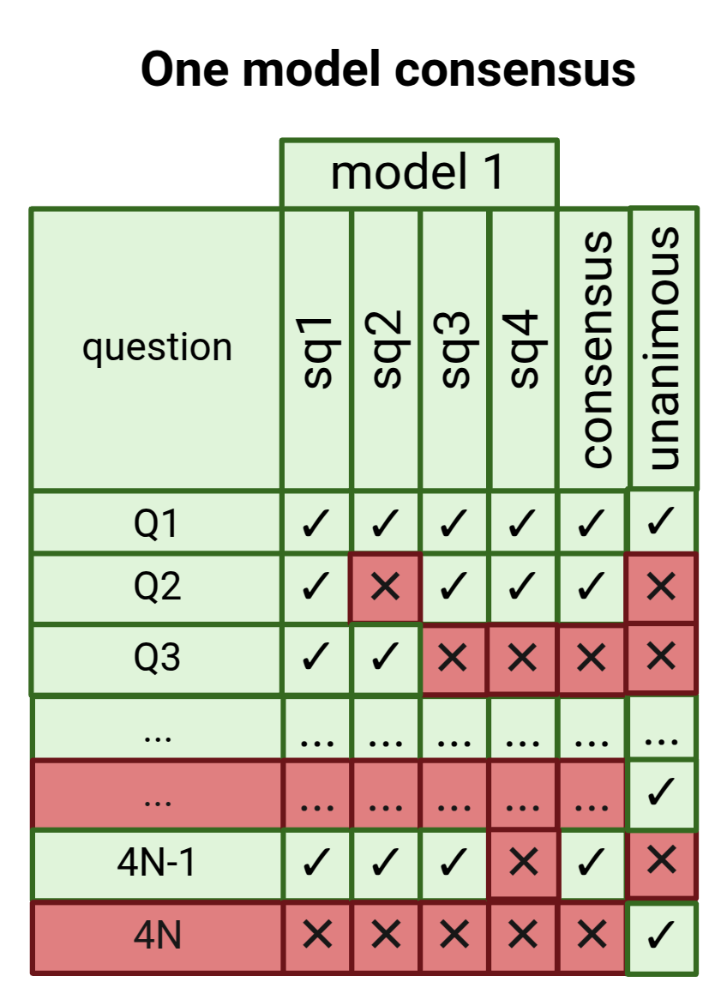
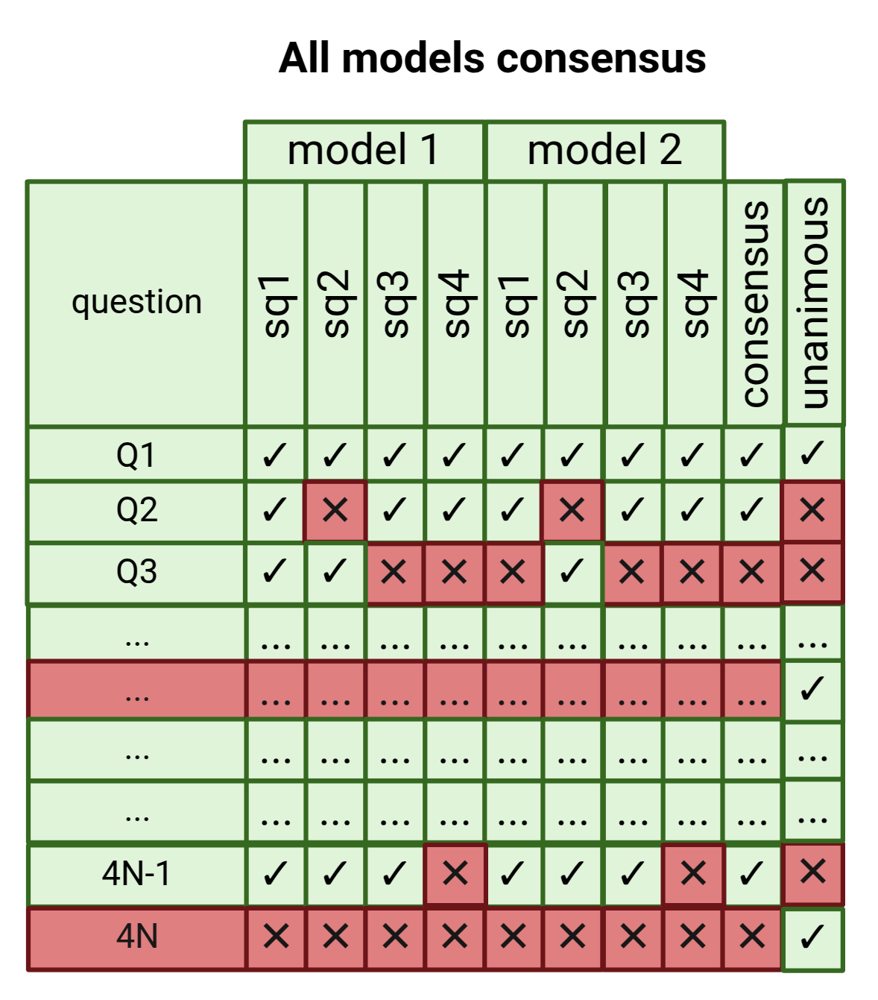

Consensus
+++++++++

Consensus Types
================

There are many consensus:

.. note::
  The most voted of 
    1. the 4DSSQ  ~ OMC
    2. the Multi-Model ~ MMC
    3. 3Sources consensus ~ 2CRSP

where, 2CRSP is the "two cases of randomly selected pathways":
  - the user select only 2 disease cases.
  - using Gemini 1.5-flash, DPC randomly selects 30 pathways:
    - 15 which curation answer is "Yes"
    - 15 which curation answer is "No"

The One-Model Consensus (OMC)
===============================

The One-Model Consensus (OMC) determines the consensus for each query by identifying the most frequently voted answer among the 4DSSQ (as shown in the figure below) for a single Gemini model and a single run. For each pathway, four similar semantic questions (sq) are formulated. If three or four of the answers are "Yes" or "No," the consensus is classified as "Yes" or "No," respectively. An answer of "Possible" is treated as "Yes," while "Low evidence" is treated as "No." In cases with a tie, the consensus is labelled as "Doubt." Additionally, the unanimous flag is set to True if all four answers from the 4DSSQ are the same; otherwise, it is set to False.

The One-Model Consensus (OMC) table consists of questions formulated from pathways as rows. The columns display the answers from the 4DSSQs (sq1, sq2, sq3, and sq4) and the consensus and unanimous flag columns. To calculate the consensus: a) if any permutation contains three 'Yes' answers or three 'No' answers, the consensus will be 'Yes' or 'No', respectively; b) if the answers consist of two 'Yes' and two 'No', the result will be 'Doubt;' c) if all four answers are 'Yes' or 'No', the consensus will be 'Yes' or 'No', respectively, and the unanimous flag will be True. In all other cases, the unanimous flag will be False.

The Multi-model Consensus (MMC)
===============================

The Multi-model Consensus (MMC) is calculated based on the multi-model consensus table (MMCtab), which consists of two or more 4DSSQ, each corresponding to a different Gemini model (see SFigure 3). Unlike a typical voting process where the most-voted answer comes from a single model, the MMC reflects the collective answers from all selected models. We utilise the MMC to compare the answers generated by Gemini with those from PubMed and the human consensus, and we also use it to calculate the CSC.

The Multi-model Consensus Reproducibility (MMCR) uses two MMC tables by comparing two runs. It is the most robust soft reproducibility metric. In the MMCtab, rows are pathways (transformed into queries), columns are all possible questions (4 groups * N), and 'sq' denotes the semantic questions, with 4DSSQ for each model. Next, the consensus column is calculated as the most-voted answer using all models' sq, filled with a 'Yes', 'No', or 'Doubt'. Finally, "unanimous" behaves as a flag; it is a column filled with True if all 8 questions are equal; otherwise, it is False.