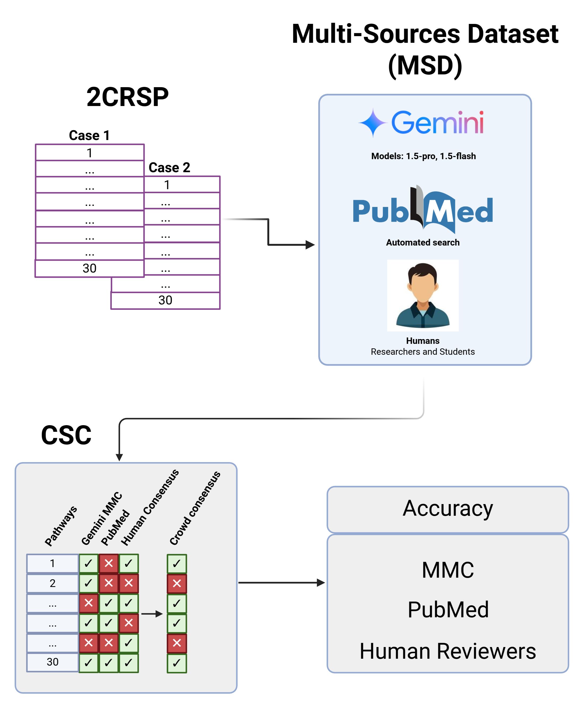

Digital Pathway Curation (DPC)
+++++++

Concepts
============

The Digital Pathway Curation (DPC) pipeline was designed and tested to address the following questions related to biomedical searches:

  1. How can we demonstrate that a molecular biological pathway is related to a disease?
  2. How can we demonstrate whether a set of molecular biological pathways, calculated beyond the default cutoffs using GSEA, is associated with a disease?
  3. How can someone query Gemini in a natural language and retrieve reproducible answers without hallucinations?
  4. How can we quantify AI-generated answers, make inferences, and calculate statistics?
  5. How can we demonstrate that Gemini delivers reproducible results using a set of biomedical questions?

Regarding the relationship between a set of molecular biological pathways and a disease, we also considered the following questions:

  6. How can we calculate the accuracy of the answers provided by Gemini, PubMed, and humans?
  7. How do we uncover FP and FN in a given enriched table?

DPC was written in Python and integrated with the Gemini AI and PubMed through their web services. It stores an Ensemble of questions and answers to perform counts, comparisons and statistical analyses.

In this study, we defined and measured the concepts of consensus, reproducibility, crowdsourcing, and accuracy. Using a smaller dataset using the two disease case pathways (the 2CRSP), we calculated crowdsource consensus (CSC) and assessed the accuracy of each source: Gemini, PubMed, and human evaluations. Our findings indicate that Gemini's consensus accuracy outperformed the PubMed and human accuracies. Additionally, using Gemini, we could uncover False Positive (FP) and False Negative (FN) pathways related to each disease case and confirm the True Positive (TP) and True Negative (TN) pathways.

DPC aims to  

  1. Calculate Gemini (LLM) reproducibility  
  2. Calculate the consensus through the 4DSSQ  
  3. Merge the "3 Sources" to perform the Multi-Source Dataset (MSD) and calculate the CSC  
  4. Calculate each source's accuracy to define the best model
  5. With the best model, calculate the confusion matrix, focusing in uncovering the FP and FN pathways

