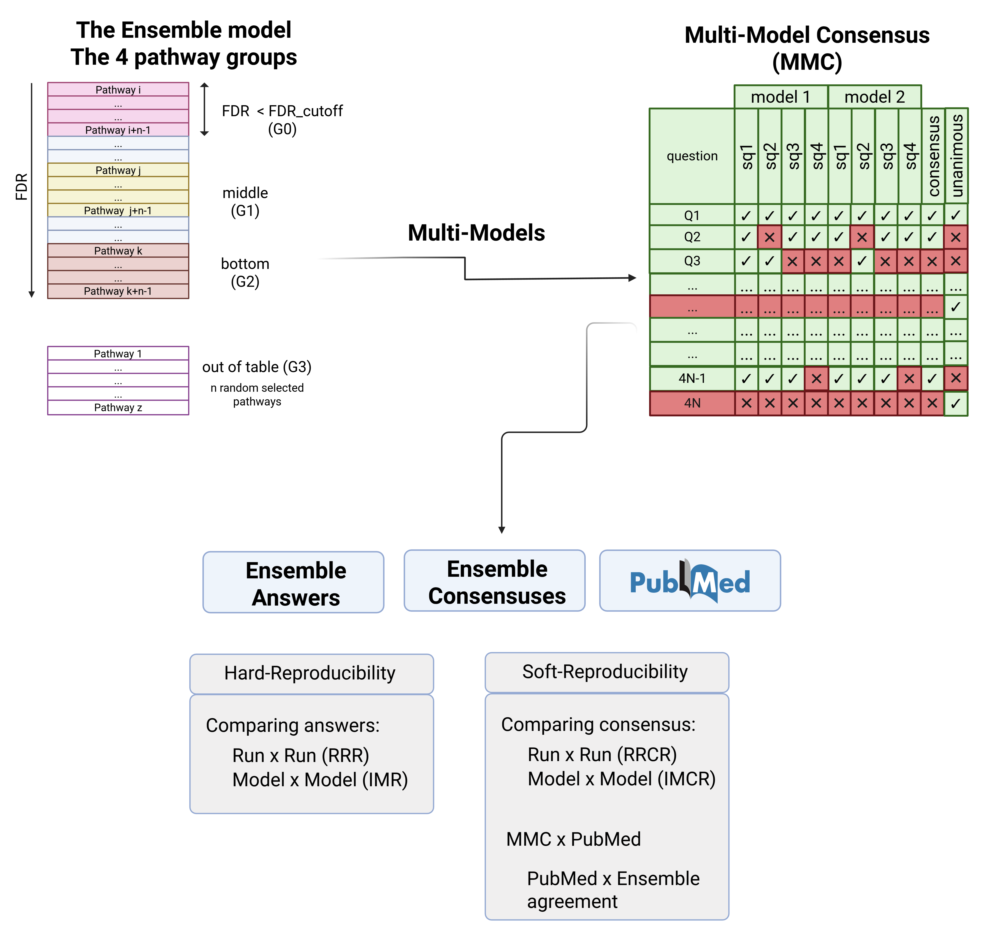

Ensemble
+++++++++

The Ensemble dataset is created using three selected groups of pathways from the GSEA table, and one additional group obtained outside the calculated table for each disease case/subtype, which is referred to as the 4 pathway groups. The method to select the four pathway groups (see Figure below) can be found in the supplementary information (SI). 

.. Note:: 
In the first part of this study, we build a large dataset called Ensemble to measure LLM reproducibility. Next, we compare the Ensemble consensuses to PubMed findings. In this analysis, we discuss PubMed's potential benefits and limitations. 

In the second part of this study, we build a smaller dataset called the Multi-Source Dataset (MSD), which includes the Gemini consensus, PubMed findings, and Human Reviewers consensus. The MSD is used to calculate the Crowdsourced Consensus (CSC)24 and assess the accuracy of each source.

In A, one can visualise the enriched pathway table from which we gather the selected pathways to build the Ensemble dataset. Pathways were calculated according to GSEA and pathway groups are divided into 4 groups: 1) the default enriched pathways and additional pathways having n pathways (G0), 2) n pathways in the middle of the table (G1), 3) n pathways at the end of the table (G2), and 4) n randomly selected pathways (G3) obtained using the complementary Reactome table without the calculated GSEA pathways. In B, one can visualise the Multi-Model Consensus (MMC) table, and in C, the hard-reproducibility, followed by, in D, the soft-reproducibility, the last, also containing the PubMed x Ensemble agreement.

Ensemble Model
============

The Ensemble allows for evaluating the "hard reproducibility" (focusing on each pathway answer) and the "soft reproducibility" (focusing on each pathway consensus) by comparing results across multiple runs or Gemini models. We also compare each pathway consensus to each PubMed finding using the Gemini MMC.

The first summary table is the One-Model Consensus (OMC), which determines the consensus for each pathway by identifying the most frequently voted answer among the 4DSSQ using a single Gemini model and a single run. Next, we combine many OMCs from different Gemini models, creating a more robust consensus table called the Multi-Model Consensus (MMC).

In addition to Gemini and PubMed results, we introduced human evaluation, which consists of sending the same list of pathways to researchers and students. The MSD allows for calculating the Crowdsourced Consensus (CSC) and assessing the accuracy of Gemini, PubMed, and human evaluations.

