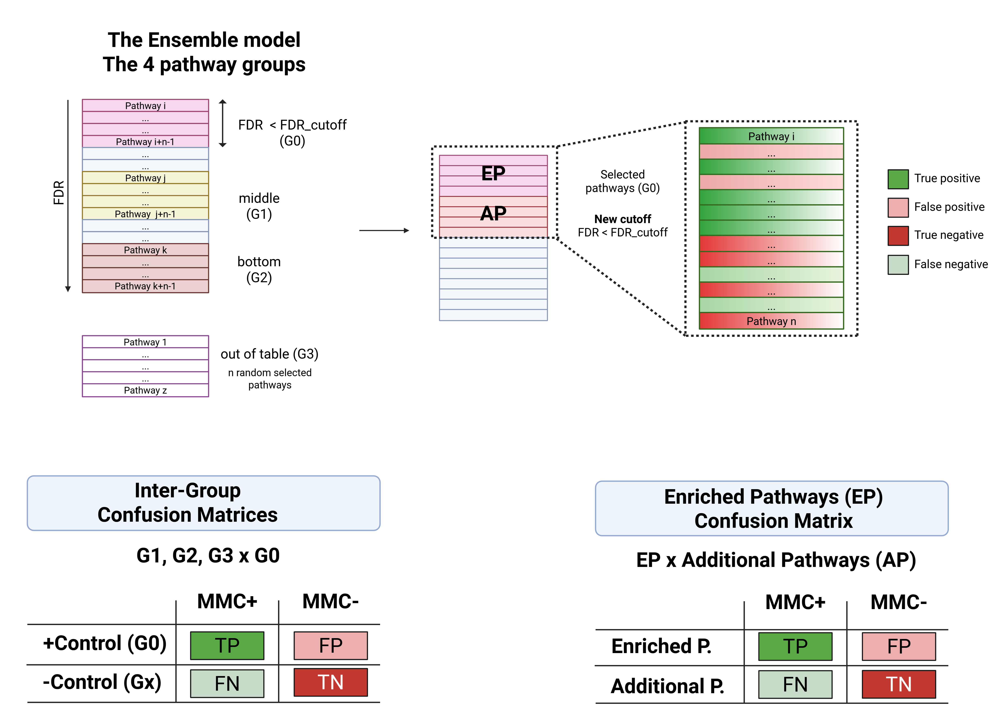

Confusion Matrices (CM)
+++++++++++++++++++++++++

Concepts
============

In the third part, we analyse different confusion matrices. By analysing the Enriched Pathways Confusion Matrix, one can achieve one of the goals of DPC: to uncover FN pathways. Gemini multi-model consensus (MMC) demonstrated the highest accuracy and was used as a reference to uncover False Positives (FP) and False Negatives (FN) while also confirming True Positives (TP) and True Negatives (TN) among the enriched pathways identified through Gene Set Enrichment Analysis (GSEA).

The Ensemble model allows us to assess the omic experiment effectively by comparing G3 (negative control) and G1 or G2 (intermediary negative controls, the cloudy zone) to G0 (positive control). In this context, the number of TPs and TNs must be confirmed by comparing G3 to G0, since one expects a large number of TPs and TNs in this comparison and an increased number of FPs and FNs by comparing the cloudy zone to G0 (see Figure 4).

In contrast, the “Enriched Pathway Confusion Matrix” is defined based on the “Enriched Pathways” result, based on the default cutoff parameters, as the positive control, and “Additional Pathways,” obtained from relaxed cutoff parameters, as the negative control. Therefore, TPs and TNs can be confirmed, FPs ask if possible LLM mistakes are factual, and FNs reveal possible new pathways to be validated.

Inter-group Confusion Matrix
==============================

The Inter-Group Confusion Matrix utilises the GSEA results grouping in four pathway groups. It compares the positive control group (G0), the enriched table with additional pathways, against the other three groups. The primary comparison is between the Positive Control Group (G0) and the Negative Control Group (G3).

  - **Cloudy zone**

  As mentioned, G0 is the positive control, while G3 is the negative control. It means that when we shift our comparisons from G1xG0 and G2xG0 to G3xG0, we can expect an increase in true values and a decrease in false values. In other words, comparing G1 and G2 (the cloudy zone) to G0 will likely yield fewer TPs and TNs and a higher number of FPs and FNs. In contrast, by comparing G3 to G0, we must achieve the maximum number of TPs and TNs while minimising FPs and FNs. Therefore, as we approach the comparison of G3xG0, both sensitivity and specificity are expected to trend toward 1.

Enriched Pathways Confusion Matrix
======================================

The Enriched Pathway Confusion Matrix utilises the calculated enriched pathways based on the default cutoff parameters and the additional pathways obtained from relaxed cutoff parameters. The algorithm designates the enriched pathways as TPs and the additional pathways as TNs to initiate the construction of the confusion matrix. Following this, FPs and FNs are uncovered using the results from the MMC.

