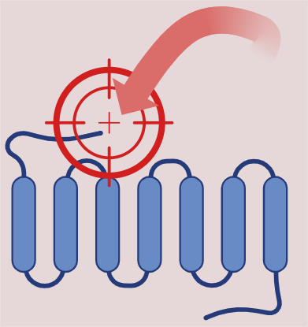

.. Molecular Target Discovery pipeline (MTDp) documentation master file, created by
   sphinx-quickstart on Sat Apr 19 18:15:04 2025.
   You can adapt this file completely to your liking, but it should at least
   contain the root `toctree` directive.

Molecular Target Discovery pipeline (MTDp)
============================================

.. toctree::
   :maxdepth: 2
   :hidden:
   :caption: MTDp:

   mtd_project/motive
   mtd_project/next_steps

.. toctree::
   :maxdepth: 2
   :hidden:
   :caption: DPC:

   dpc/DPC
   dpc/Ensemble
   dpc/Consensus
   dpc/CSC
   dpc/source_code
   dpc/how_to_use

.. toctree::
   :maxdepth: 2
   :hidden:
   :caption: BCA:

   bca/BCA

.. toctree::
   :maxdepth: 2
   :hidden:
   :caption: pPMod:

   ppmod/pPMod

