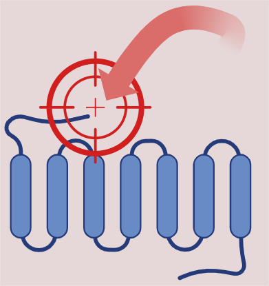

.. Molecular Target Discovery pipeline (MTDp) documentation master file, created by
   sphinx-quickstart on Sat Apr 19 18:15:04 2025.
   You can adapt this file completely to your liking, but it should at least
   contain the root `toctree` directive.

Molecular Target Discovery project (MTDp)
=========================================

The “Molecular Pathway Discovery” project is an open-source project that began in the middle of 2021 due to the COVID-19 pandemic. The goal of this project is to provide a set of tools to help researchers in molecular biology and systems biology curate pathways and suggest possible genes and molecular targets for drug discovery. It consists of 4 pipelines:

  - Best Cutoff Algorithm (BCA)
  - Digital Pathway Curation (DPC)
  - pseudo Pathway Modulation (pPMod)
  - *in silico* Target Curation (isTC)

The current documentation focuses on the first two pipelines: BCA and DPC. 
 
DPC introduces significant methods for evaluating Large Language Models (LLM), particularly in Bioinformatics and Systems Biology. 

The Digital Pathway Curation pipeline was designed to retrieve answers from distinct semantic questions by formulating queries crossing a disease to biomedical pathways. We devised and tested a specific query format, which produced systematic answers that could be quantified. Next, we developed different methods to calculate precise metrics for evaluating the LLM's reproducibility, consensus, and accuracy. The Multi-Model Consensus (MMC) method demonstrated strong results by achieving the consensus among multiple Gemini models. MMC accuracy outperforms PubMed and Human accuracies. Most notably, the final approach, the "confusion matrices method", was able to evaluate the Gene Set Enrichment Analysis (GSEA) results and identify False Positive and False Negative Pathways. Uncover False Negative Pathways opens new opportunities and hypotheses for future researchers.

.. Note:: 
  | Bio and Immunoinformatics, Systems Biology, and Artificial Intelligence Laboratory (BISAI-Lab)  
  | PhD Flavio Lichtenstein  
  | email: flavio.lichtenstein@butantan.gov.br  

  | `Centre of Excellence in New Target Discovery (CENTD) <https://centd.butantan.gov.br/US/>`_
  | Development and Innovation Center (CDI)
  | `Instituto Butantan <https://en.butantan.gov.br/>`_

.. toctree::
   :maxdepth: 2
   :hidden:
   :caption: MTDp

   mtd_project/motive
   mtd_project/next_steps
   mtd_project/new_user

.. toctree::
   :maxdepth: 2
   :hidden:
   :caption: DPC

   dpc/DPC
   dpc/Ensemble
   dpc/SemanticQuestions
   dpc/Consensus
   dpc/CSC
   dpc/confusion_matrices

.. toctree::
   :maxdepth: 2
   :hidden:
   :caption: BCA

   bca/BCA

.. toctree::
   :maxdepth: 2
   :hidden:
   :caption: pPMod

   ppmod/pPMod

.. toctree::
   :maxdepth: 2
   :hidden:
   :caption: how_to_use

   how_to_use/how_to_use_DPC

.. toctree::
   :maxdepth: 2
   :hidden:
   :caption: source

   source/source_code

