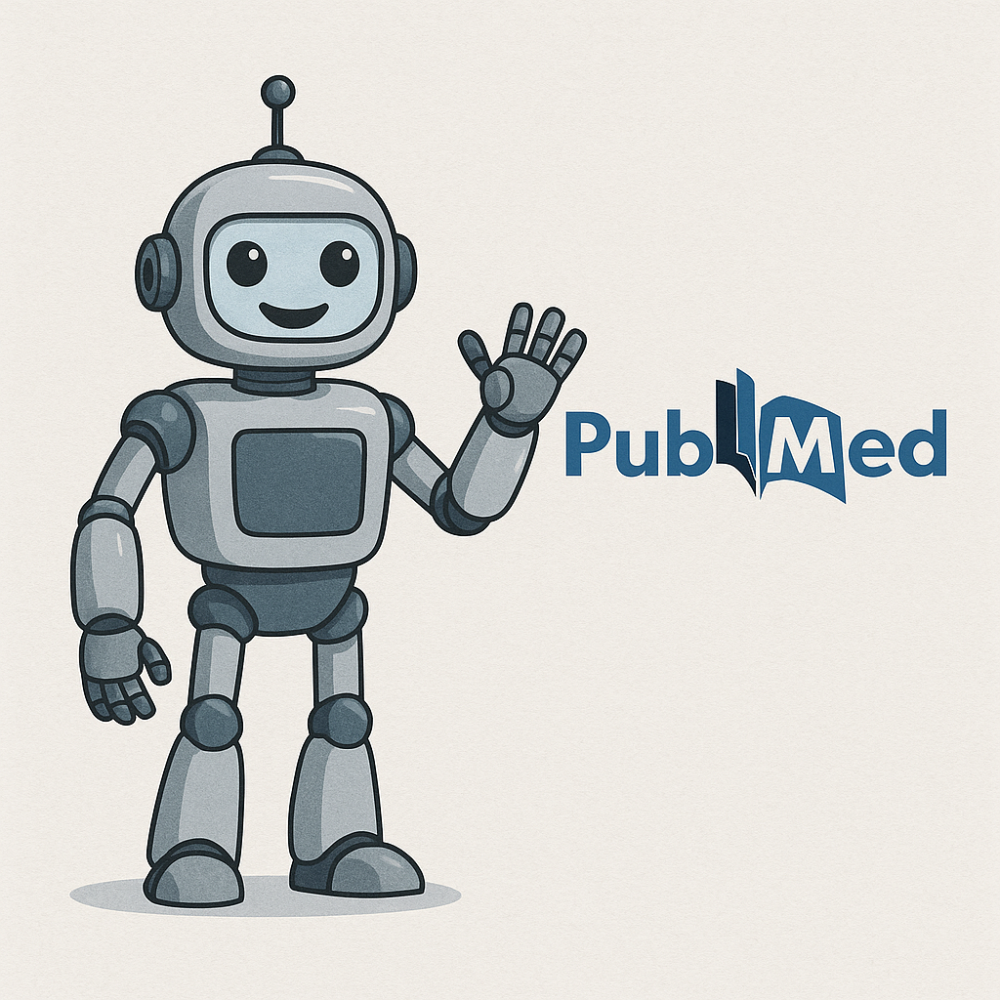

.. Como pesquisar na PubMed e utilizando Inteligência Artificial (IA): teoria, coneitos e prática.

Como pesquisar na PubMed e utilizando Inteligência Artificial?
===============================================================

Este é um mini-curso para introduzir alunos a como pesquisar na PubMed. Conhecer sua capacidade e limitações. 

Na segunda parte, introduzimos IA e como utilizá-la para pesquisa científica.

Por fim, fazemos uma comparação entre PubMed e pesquisa no Gemini, e mostramos como a IA pode ajudar na pesquisa científica, atualmente. Neste útlimo tópico mostramos como acessar estas ferramentas com Python/WebServices, ou seja, para obter dados em auantidade para pesquisa e estatísica. Logo, a seguir, mostramos cnceitos estatísticos. Por fim, encerramos apresentando modelos de Refinamento de LLMs e divagações sobre o futuro da pesquisa em literatura científica.

Obs: image by chat-gpt (https://chatgpt.com/)

.. Note:: 
  | Bio and Immunoinformatics, Systems Biology, and Artificial Intelligence Laboratory (BISAI-Lab)  
  | PhD Flavio Lichtenstein  
  | email: flavio.lichtenstein@butantan.gov.br  

  | `Centre of Excellence in New Target Discovery (CENTD) <https://centd.butantan.gov.br/US/>`_
  | Development and Innovation Center (CDI)
  | `Instituto Butantan <https://en.butantan.gov.br/>`_

.. toctree::
   :maxdepth: 2
   :hidden:
   :caption: PubMed

   aula01/introducao
   aula01/pubmed_basico
   aula01/pubmed_2palavras
   aula01/pubmed_concept_2qual
   aula01/pubmed_removendo_FN
   aula01/teoria_conjuntos
   aula01/algebra_bool
   aula01/matriz_de_confusao
   aula01/pubmed_avancado
   aula01/pubmed_avancado2
   aula01/mesh_onto

.. toctree::
   :maxdepth: 2
   :hidden:
   :caption: IA

   aula02/ia_historia_fase1
   aula02/ia_fase2_3
   aula02/llm
   aula02/pesquisa_ia

.. toctree::
   :maxdepth: 2
   :hidden:
   :caption: PubMed x IA

   aula03/limitacoes_pubmed
   aula03/webservices
   aula03/pubmed_gemini
   aula03/sensibil_especif
   aula03/encerramento

